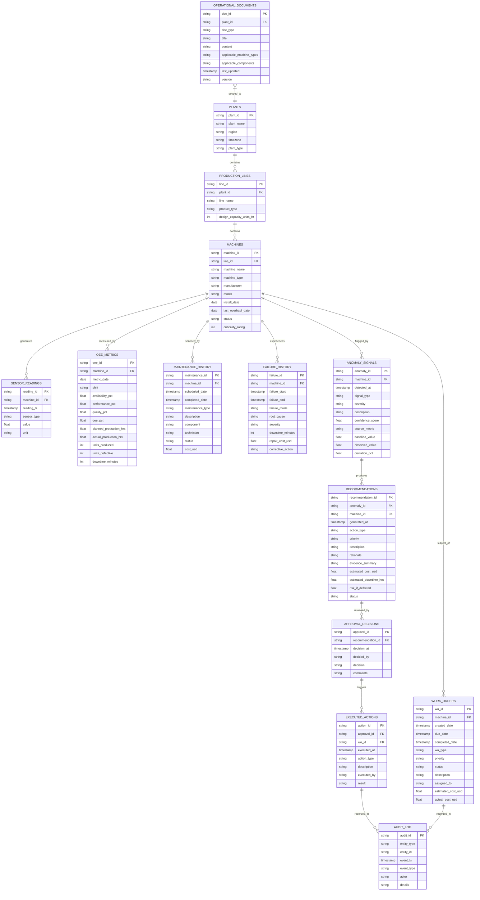

# OpsMind AI — Enterprise Data Model

## Overview

This document defines the domain model for OpsMind AI's manufacturing operations intelligence platform. The model supports the full DETECT → INVESTIGATE → EXPLAIN → PREDICT → QUANTIFY → RECOMMEND → APPROVE → EXECUTE → AUDIT workflow across multi-plant manufacturing operations.

## Data Classification

The model is organized into six logical categories:

| Category | Purpose | Access Pattern |
|----------|---------|----------------|
| **Master Data** | Slowly-changing reference entities (plants, lines, machines) | Cortex Analyst |
| **Transactional Data** | Business events (maintenance, failures, work orders) | Cortex Analyst |
| **Time-Series Data** | High-frequency sensor telemetry and computed metrics | Cortex Analyst |
| **AI/Analytical Output** | System-generated anomaly signals and recommendations | Cortex Analyst |
| **Governance/Audit Data** | Human decisions, executed actions, audit trail | Cortex Analyst |
| **Unstructured Knowledge** | SOPs, manuals, troubleshooting guides | Cortex Search |

## Entity-Relationship Diagram



## Entity Definitions

### Master Data

#### PLANTS
Primary reference for manufacturing facilities.

| Column | Type | Nullable | Description |
|--------|------|----------|-------------|
| plant_id | STRING | No | Primary key (e.g., PLT-001) |
| plant_name | STRING | No | Human-readable name |
| region | STRING | No | Geographic region |
| timezone | STRING | No | IANA timezone |
| plant_type | STRING | No | Facility type (e.g., Assembly, Processing) |

#### PRODUCTION_LINES
Manufacturing lines within plants.

| Column | Type | Nullable | Description |
|--------|------|----------|-------------|
| line_id | STRING | No | Primary key (e.g., LINE-101) |
| plant_id | STRING | No | FK → PLANTS |
| line_name | STRING | No | Human-readable name |
| product_type | STRING | No | What the line produces |
| design_capacity_units_hr | INT | No | Nameplate throughput |

#### MACHINES
Individual equipment assets on production lines.

| Column | Type | Nullable | Description |
|--------|------|----------|-------------|
| machine_id | STRING | No | Primary key (e.g., M-301, M-302) |
| line_id | STRING | No | FK → PRODUCTION_LINES |
| machine_name | STRING | No | Descriptive name |
| machine_type | STRING | No | Equipment category (CNC Mill, Press, etc.) |
| manufacturer | STRING | No | OEM name |
| model | STRING | No | Model identifier |
| install_date | DATE | No | Installation date |
| last_overhaul_date | DATE | Yes | Most recent major overhaul |
| status | STRING | No | Current status (operational, degraded, down) |
| criticality_rating | INT | No | 1-5 scale (5 = most critical) |

### Time-Series Data

#### SENSOR_READINGS
High-frequency equipment telemetry.

| Column | Type | Nullable | Description |
|--------|------|----------|-------------|
| reading_id | STRING | No | Primary key |
| machine_id | STRING | No | FK → MACHINES |
| reading_ts | TIMESTAMP | No | Measurement time |
| sensor_type | STRING | No | vibration, temperature, spindle_speed, power_consumption, coolant_pressure, bearing_temp |
| value | FLOAT | No | Measured value |
| unit | STRING | No | Unit of measure (mm/s, °C, RPM, kW, bar) |

#### OEE_METRICS
Daily/shift-level Overall Equipment Effectiveness.

| Column | Type | Nullable | Description |
|--------|------|----------|-------------|
| oee_id | STRING | No | Primary key |
| machine_id | STRING | No | FK → MACHINES |
| metric_date | DATE | No | Measurement date |
| shift | STRING | No | Shift identifier (day, swing, night) |
| availability_pct | FLOAT | No | Availability component (0-100) |
| performance_pct | FLOAT | No | Performance component (0-100) |
| quality_pct | FLOAT | No | Quality component (0-100) |
| oee_pct | FLOAT | No | Overall OEE = A × P × Q / 10000 |
| planned_production_hrs | FLOAT | No | Scheduled production time |
| actual_production_hrs | FLOAT | No | Actual runtime |
| units_produced | INT | No | Parts produced |
| units_defective | INT | No | Rejected parts |
| downtime_minutes | INT | No | Unplanned downtime |

### Transactional Data

#### MAINTENANCE_HISTORY
Completed and scheduled maintenance activities.

| Column | Type | Nullable | Description |
|--------|------|----------|-------------|
| maintenance_id | STRING | No | Primary key |
| machine_id | STRING | No | FK → MACHINES |
| scheduled_date | TIMESTAMP | No | When maintenance was planned |
| completed_date | TIMESTAMP | Yes | When maintenance was completed (null if pending/overdue) |
| maintenance_type | STRING | No | preventive, corrective, predictive, inspection |
| description | STRING | No | Work description |
| component | STRING | No | Target component (bearing, spindle, motor, etc.) |
| technician | STRING | Yes | Assigned technician |
| status | STRING | No | completed, scheduled, overdue, cancelled |
| cost_usd | FLOAT | Yes | Actual or estimated cost |

#### FAILURE_HISTORY
Historical equipment failures.

| Column | Type | Nullable | Description |
|--------|------|----------|-------------|
| failure_id | STRING | No | Primary key |
| machine_id | STRING | No | FK → MACHINES |
| failure_start | TIMESTAMP | No | Failure onset |
| failure_end | TIMESTAMP | Yes | Resolution time |
| failure_mode | STRING | No | Failure category |
| root_cause | STRING | No | Determined root cause |
| severity | STRING | No | critical, major, minor |
| downtime_minutes | INT | No | Total downtime caused |
| repair_cost_usd | FLOAT | No | Repair cost |
| corrective_action | STRING | No | What was done |

#### WORK_ORDERS
Maintenance work order lifecycle.

| Column | Type | Nullable | Description |
|--------|------|----------|-------------|
| wo_id | STRING | No | Primary key |
| machine_id | STRING | No | FK → MACHINES |
| created_date | TIMESTAMP | No | Creation timestamp |
| due_date | TIMESTAMP | Yes | Target completion date |
| completed_date | TIMESTAMP | Yes | Actual completion (null if open) |
| wo_type | STRING | No | preventive, corrective, emergency, inspection |
| priority | STRING | No | critical, high, medium, low |
| status | STRING | No | open, in_progress, completed, cancelled |
| description | STRING | No | Work description |
| assigned_to | STRING | Yes | Assigned technician or team |
| estimated_cost_usd | FLOAT | Yes | Budget estimate |
| actual_cost_usd | FLOAT | Yes | Final cost (null if incomplete) |

### AI/Analytical Output

#### ANOMALY_SIGNALS
System-detected anomaly indicators.

| Column | Type | Nullable | Description |
|--------|------|----------|-------------|
| anomaly_id | STRING | No | Primary key |
| machine_id | STRING | No | FK → MACHINES |
| detected_at | TIMESTAMP | No | Detection timestamp |
| signal_type | STRING | No | vibration_anomaly, thermal_anomaly, oee_decline, performance_loss |
| severity | STRING | No | critical, warning, info |
| description | STRING | No | Human-readable description |
| confidence_score | FLOAT | No | 0.0–1.0 confidence |
| source_metric | STRING | No | Triggering metric |
| baseline_value | FLOAT | No | Expected normal value |
| observed_value | FLOAT | No | Actual observed value |
| deviation_pct | FLOAT | No | Percentage deviation from baseline |

#### RECOMMENDATIONS
AI-generated action recommendations.

| Column | Type | Nullable | Description |
|--------|------|----------|-------------|
| recommendation_id | STRING | No | Primary key |
| anomaly_id | STRING | No | FK → ANOMALY_SIGNALS |
| machine_id | STRING | No | FK → MACHINES |
| generated_at | TIMESTAMP | No | Generation timestamp |
| action_type | STRING | No | inspect, repair, replace, schedule_maintenance |
| priority | STRING | No | critical, high, medium, low |
| description | STRING | No | Recommended action |
| rationale | STRING | No | Why this is recommended |
| evidence_summary | STRING | No | Key evidence points |
| estimated_cost_usd | FLOAT | No | Projected cost |
| estimated_downtime_hrs | FLOAT | No | Projected downtime |
| risk_if_deferred | STRING | No | Consequence of inaction |
| status | STRING | No | pending, approved, rejected, executed |

### Governance/Audit Data

#### APPROVAL_DECISIONS
Human approval or rejection of recommendations.

| Column | Type | Nullable | Description |
|--------|------|----------|-------------|
| approval_id | STRING | No | Primary key |
| recommendation_id | STRING | No | FK → RECOMMENDATIONS |
| decision_at | TIMESTAMP | No | Decision timestamp |
| decided_by | STRING | No | Approver identity |
| decision | STRING | No | approved, rejected, deferred |
| comments | STRING | Yes | Approver notes |

#### EXECUTED_ACTIONS
Record of actions taken after approval.

| Column | Type | Nullable | Description |
|--------|------|----------|-------------|
| action_id | STRING | No | Primary key |
| approval_id | STRING | No | FK → APPROVAL_DECISIONS |
| wo_id | STRING | Yes | FK → WORK_ORDERS (if work order created) |
| executed_at | TIMESTAMP | No | Execution timestamp |
| action_type | STRING | No | work_order_created, inspection_scheduled, part_ordered |
| description | STRING | No | What was done |
| executed_by | STRING | No | Who/what executed |
| result | STRING | No | Outcome description |

#### AUDIT_LOG
Immutable event trail across all entity types.

| Column | Type | Nullable | Description |
|--------|------|----------|-------------|
| audit_id | STRING | No | Primary key |
| entity_type | STRING | No | Which table/entity |
| entity_id | STRING | No | Referenced entity PK |
| event_ts | TIMESTAMP | No | Event timestamp |
| event_type | STRING | No | created, updated, approved, rejected, executed |
| actor | STRING | No | User or system identity |
| details | STRING | No | Event description |

### Unstructured Knowledge

#### OPERATIONAL_DOCUMENTS
Source table for Cortex Search ingestion.

| Column | Type | Nullable | Description |
|--------|------|----------|-------------|
| doc_id | STRING | No | Primary key |
| plant_id | STRING | Yes | FK → PLANTS (null if global) |
| doc_type | STRING | No | sop, manual, troubleshooting_guide, safety_bulletin |
| title | STRING | No | Document title |
| content | STRING | No | Full document text (Markdown) |
| applicable_machine_types | STRING | Yes | Comma-separated machine types |
| applicable_components | STRING | Yes | Comma-separated components |
| last_updated | TIMESTAMP | No | Document version date |
| version | STRING | No | Version identifier |

## Cortex Integration Design

### Cortex Analyst (Semantic View) — Structured Data

The semantic view will expose the following tables for natural-language SQL generation:

- PLANTS
- PRODUCTION_LINES
- MACHINES
- SENSOR_READINGS
- OEE_METRICS
- MAINTENANCE_HISTORY
- FAILURE_HISTORY
- WORK_ORDERS
- ANOMALY_SIGNALS
- RECOMMENDATIONS
- APPROVAL_DECISIONS
- EXECUTED_ACTIONS

Key metrics defined in the semantic view:
- **OEE** — availability × performance × quality
- **Mean Time Between Failures (MTBF)**
- **Downtime minutes** — by machine, line, plant
- **Maintenance cost** — by machine, type, period
- **Anomaly count** — by severity, machine

Key dimensions:
- Plant, line, machine hierarchy
- Time (date, shift, week, month)
- Maintenance type, failure mode, severity
- Work order status, priority

### Cortex Search — Unstructured Knowledge

The OPERATIONAL_DOCUMENTS table feeds a Cortex Search service. The agent retrieves documents by:

- Machine type relevance
- Component relevance
- Symptom/condition keywords (vibration, temperature, bearing, threshold)

The documents intentionally contain threshold values and procedural guidance that the agent must correlate with structured anomaly data to reach conclusions.

## Data Lineage: Source → AI Recommendation → Action

```
SENSOR_READINGS ─────┐
                     ├──→ ANOMALY_SIGNALS ──→ RECOMMENDATIONS ──→ APPROVAL_DECISIONS ──→ EXECUTED_ACTIONS ──→ AUDIT_LOG
OEE_METRICS ─────────┤
                     │
MAINTENANCE_HISTORY ─┤
                     │
FAILURE_HISTORY ─────┘

OPERATIONAL_DOCUMENTS ──→ (Cortex Search retrieval during investigation)
```

The investigation workflow joins structured evidence (sensor trends, OEE decline, maintenance gaps, failure patterns) with unstructured evidence (SOP thresholds, troubleshooting procedures) to produce recommendations that require human approval before execution.

## Design Rationale

1. **Separate master/transactional/time-series** — Different update frequencies and query patterns. Semantic view handles joins.
2. **Explicit anomaly → recommendation → approval → action chain** — Enforces governance and auditability (ADR-007, ADR-008).
3. **Documents in a table, not files** — Simplifies Cortex Search service creation from SQL. Content stored as text avoids stage/file complexity for the hackathon.
4. **String primary keys with prefixes** — Human-readable, debuggable, greppable across CSVs and logs.
5. **OEE as pre-computed daily/shift metric** — Avoids real-time calculation complexity while providing trend analysis capability.
6. **Sensor readings as long-format** — One row per reading with sensor_type column. Flexible for varying sensor sets across machine types.
7. **Audit log as append-only** — Supports compliance and investigation replay without modifying source records.
