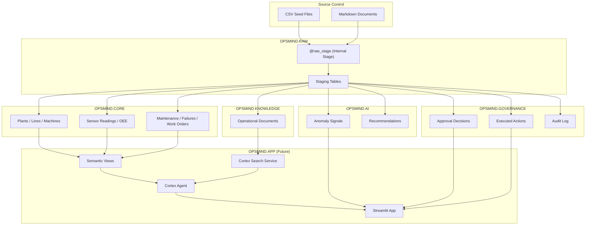

# OpsMind AI — Snowflake Architecture

## Schema Design

```
OPSMIND (Database)
├── RAW           — Ingestion staging for seed/source data
├── CORE          — Governed operational facts (investigation inputs)
├── KNOWLEDGE     — Unstructured operational documents (Cortex Search source)
├── AI            — AI-generated outputs: anomalies, recommendations
├── GOVERNANCE    — Human decisions, actions, audit trail
└── APP           — Application objects: Semantic Views, Agent, Streamlit
```

### Schema Responsibilities

| Schema | Contents | Access Pattern |
|--------|----------|----------------|
| **RAW** | Staging tables, file formats, internal stages for CSV/document loading. Transient landing zone. | Write: ADMIN during deployment. Read: ETL/load processes only. |
| **CORE** | Master data (plants, lines, machines), time-series (sensors, OEE), transactional history (maintenance, failures, work orders). These are the investigation inputs. | Read: ANALYST, OPERATOR via Cortex Analyst semantic view. Write: ADMIN. |
| **KNOWLEDGE** | Operational documents table (SOPs, manuals, troubleshooting guides). Source for future Cortex Search service. | Read: Cortex Search service. Write: ADMIN. |
| **AI** | Anomaly signals, recommendations. System-generated analytical outputs. | Read: OPERATOR for review. Write: AI system/ADMIN. |
| **GOVERNANCE** | Approval decisions, executed actions, audit log. Human-in-the-loop governance chain. | Read: OPERATOR, ANALYST (audit). Write: OPERATOR (approvals), system (actions, audit). |
| **APP** | Future home of Semantic Views, Cortex Agent, Streamlit app. Empty in Phase 2. | Managed by ADMIN; used by ANALYST/OPERATOR at runtime. |

### Design Rationale

- **RAW separate from CORE**: Seed data lands in RAW staging tables first, then is loaded into CORE. This mirrors a real ETL pattern and keeps CORE clean.
- **KNOWLEDGE separate from CORE**: Documents are unstructured text destined for Cortex Search, not Cortex Analyst. Separate schema makes the boundary explicit.
- **AI separate from CORE**: Critical for the investigation boundary — the agent must infer root causes from CORE evidence, not read pre-generated AI conclusions. Semantic views for investigation will cover CORE only.
- **GOVERNANCE separate from AI**: Actions/approvals are human decisions, distinct from AI-generated recommendations.
- **APP as a namespace**: All application-layer objects (semantic views, agent, streamlit) live here, clearly separated from data.

## Data Flow



## Investigation / AI-Output Boundary

This boundary is critical for the integrity of the demo:

**INVESTIGATION INPUTS (CORE + KNOWLEDGE)** — What the AI reasons over:
- `CORE.PLANTS`, `CORE.PRODUCTION_LINES`, `CORE.MACHINES`
- `CORE.SENSOR_READINGS`, `CORE.OEE_METRICS`
- `CORE.MAINTENANCE_HISTORY`, `CORE.FAILURE_HISTORY`, `CORE.WORK_ORDERS`
- `KNOWLEDGE.OPERATIONAL_DOCUMENTS`

**AI OUTPUTS (AI + GOVERNANCE)** — What the AI and humans produce:
- `AI.ANOMALY_SIGNALS`, `AI.RECOMMENDATIONS`
- `GOVERNANCE.APPROVAL_DECISIONS`, `GOVERNANCE.EXECUTED_ACTIONS`, `GOVERNANCE.AUDIT_LOG`

The future Cortex Analyst semantic view will cover **CORE schema only**. The agent can read AI/GOVERNANCE for status display but must not use them to determine root cause.

The test contract (`tests/scenarios/m302_expected.json`) is **never loaded into Snowflake**.

## Role Model

### Ownership

ACCOUNTADMIN retains ownership of all OPSMIND objects during the hackathon. Custom roles receive least-privilege USAGE/SELECT/INSERT/UPDATE grants only.

**Production hardening recommendation:** Transfer OWNERSHIP of the OPSMIND database and schemas to OPSMIND_ADMIN, then restrict ACCOUNTADMIN to emergency access through the role hierarchy.

### Role Privileges

| Role | Purpose | Schema Access |
|------|---------|---------------|
| **OPSMIND_ADMIN** | Deployment, configuration, data loading | USAGE + read/write on all OPSMIND schemas. CREATE on all schemas. Stage access. |
| **OPSMIND_ANALYST** | Investigation, read evidence, use AI tools | USAGE + SELECT on CORE, KNOWLEDGE, AI only. No GOVERNANCE. No APP. |
| **OPSMIND_OPERATOR** | Analyst + approval/action workflows | Inherits ANALYST. Additionally: SELECT + INSERT on GOVERNANCE tables. UPDATE on AI.RECOMMENDATIONS (status changes). |

### Role Hierarchy

```
ACCOUNTADMIN
├── OPSMIND_ADMIN
└── OPSMIND_OPERATOR
    └── OPSMIND_ANALYST
```

All roles are granted to ACCOUNTADMIN for this hackathon environment. In production, these would be assigned to individual users/service accounts.

## Warehouse

| Property | Value |
|----------|-------|
| Name | OPSMIND_WH |
| Size | XSMALL |
| Auto-Suspend | 60 seconds |
| Auto-Resume | TRUE |
| Initially Suspended | YES |

## Future Object Locations

| Object | Schema | Phase |
|--------|--------|-------|
| Semantic Views | APP | Phase 3 |
| Cortex Search Service | APP (sourced from KNOWLEDGE) | Phase 4 |
| Cortex Agent | APP | Phase 5 |
| Streamlit App | APP | Phase 6 |

## Deployment Order

Execute `setup/sql/` scripts in numeric order:

1. `00_context.sql` — Set session context
2. `01_database_schemas.sql` — Database, schemas, warehouse
3. `02_roles_grants.sql` — Role model and grants
4. `03_tables.sql` — All table DDL
5. `04_stages_file_formats.sql` — Internal stage and CSV file format
6. `05_load_seed_data.sql` — COPY INTO from staged CSVs
7. `06_validate.sql` — Post-load validation queries

Upload seed data files to the internal stage between steps 04 and 05 using:
```
scripts/upload_seed_data.py  (or snowsql PUT commands)
```
